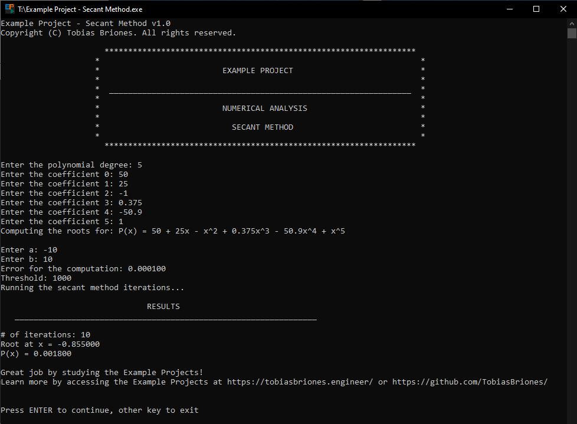
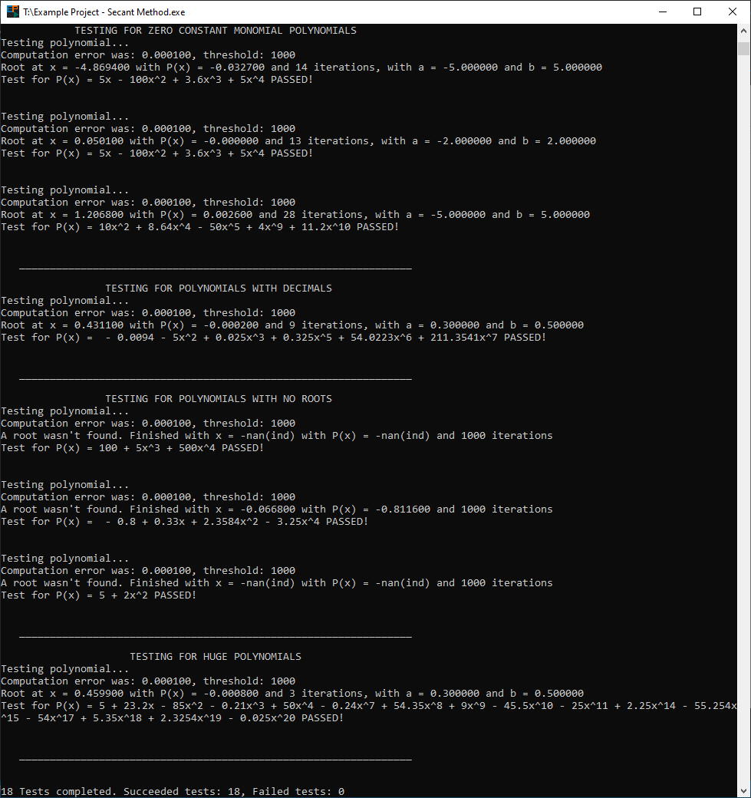

# Example Project: Secant Method

&nbsp;

Example project for computing the roots of the given polynomial through the secant method to get the
approximations, written in a C++ console application.

### Notes

If you wish to extend this project just take into account some considerations:

- Clearing the console only worked for me when debugging with VS, not when running the generated
  executable.

- Get aware of how to take the results, in this case, I computed the algorithm without rounding
  anything until finishing and then rounding the x value found and also rounding P(x) according to
  the decimal precision of 4 decimals.

- The coefficient implementation for the polynomial class can be optimized to avoid storing huge
  polynomials with lots of zero coefficients, it was just not necessary to do for this project.

- I didn't handle when a root was found but outside of [a, b], it's up to you.

- The iterations can be printed, consider when the number of iterations is less than a small number
  to avoid polluting the console with hundreds of iterations.

- The codebase can be significantly enhanced, but consider that coding C++ is time-consuming.

## Screenshots

---

## Contact

This software: [GitHub Repository](https://github.com/tobiasbriones/ep-secant-method)

Tobias Briones: [GitHub](https://github.com/tobiasbriones)

Example Project: [App](https://tobiasbriones.github.io/example-project)

## About

**Example Project: Secant Method**

Example project for computing the roots of the given polynomial through the secant method to get the
approximations.

Copyright © 2019-2020 Tobias Briones. All rights reserved.

### License

This project is licensed under the [MIT License](./LICENSE).
